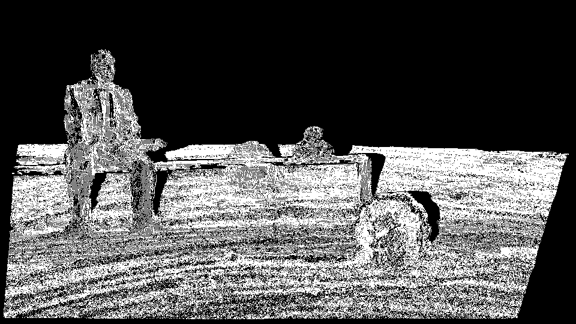

---
# 默认主题，您可以更换
theme: apple-basic
# 幻灯片标题
title: 多视图三维重建
# Markdown 信息
info: |
  计算摄影学课程项目报告
  韩墨 (3220103978)
  2025年6月
# 类名应用于当前幻灯片
class: text-center
# 背景图 (可选)
background: https://cover.sli.dev

# 过渡效果
transition: slide-left
# 启用MDC语法
mdc: true
# 您可以在此处添加全局CSS来调整字体大小，例如：
# 
---

# 多视图三维重建
# Multi-view 3D Reconstruction

计算摄影学课程项目报告

  
    开始 <carbon:arrow-right class="inline"/>
  

  韩墨 (3220103978)  
  2025年6月

<!--
大家好，我是韩墨。今天我将为大家展示我的计算摄影学课程项目——“多视图三维重建”。
-->
---
layout: default
---

# 项目简介

*   **目标**: 利用多视角彩色图像和深度图像，重建三维场景模型。

*   **核心流程**:
    1.  深度图采样与三维点生成
    2.  多视角点云融合 (基于深度一致性与颜色置信度评估)
    3.  泊松表面重建生成最终网格模型
*   **输入数据**:
    *   `.act` 文件: 包含相机内外参数、图像序列路径等。
    *   彩色图像 (e.g., `.png/jpg`)
    *   深度图像 (e.g., `.raw`, 存储视差或逆深度)
*   **输出成果**:
    *   稠密三维点云 (`point_cloud.ply`)
    *   三维表面网格模型 (`mesh_poisson.ply`)
    *   中间结果: 一致性/置信度掩码图像

<!--
首先，我们来概览一下这个项目。
项目的目标是基于模板代码,利用多视角的彩色图和深度图，重建出三维模型。
核心流程主要分为三步：首先是深度图的自适应采样和三维点生成；然后是多视角点云融合，这一步会基于深度一致性和颜色置信度进行评估；最后，我们使用泊松表面重建算法生成最终的网格模型。
项目的输入数据主要包括描述相机和图像序列的ACTS文件，以及对应的彩色图像和深度图像。
最终，我们将得到重建的稠密三维点云文件、三维表面网格模型，以及一些用于调试和分析的中间掩码图像。
-->

---
layout: default
---

# 整体算法流程:概览

我们的工程文件主要包括以下几个大的阶段：
1.  **初始化阶段**: 加载配置，预处理数据。
2.  **逐帧处理**: 对每一帧图像进行采样和点云生成。
3.  **多点云融合**: 将单帧点云融合成全局一致的点云。
    *   三维点生成与法线估计
    *   多视图深度一致性检查
    *   置信度计算
4.  **全局点云输出**: 保存融合后的点云。
5.  **三维表面重建**: 从点云生成网格模型。

<!--
接下来，我们看一下整体的算法流程。
概括来说，整个流程分为几个主要阶段：
首先是初始化阶段，主要是加载配置文件和预处理图像数据。
然后是逐参考帧处理，对序列中的每一帧图像，我们会进行深度的自适应采样，并生成初步的三维点。
紧接着是核心的多点云融合步骤，这里面又细分为三维点生成与法线估计、多视图间的深度一致性检查，以及基于颜色的置信度计算，目标是得到一个全局一致且可靠的点云。
之后，我们会将融合后的全局点云输出到文件。
最后一步，利用这个点云进行三维表面重建，生成最终的网格模型。
下面，我们会对这些步骤进行更详细的分解。
-->

---
layout: default
---

# 整体算法流程:初始化与逐帧设置

1.  **初始化阶段**:
    *   解析配置文件 (`.act`)，加载相机参数 (内参、外参)。
    *   预加载并缓存所有帧的彩色图像和深度图像数据，存入 `neighbor_cache`，方便快速访问。
2.  **逐帧 (Frame `i`) 处理 - 准备工作**:
    *   加载当前参考帧 `i` 的数据 (深度图、彩色图、相机位姿)。
    *   创建并初始化当前帧的输出掩码图像 (一致性掩码、置信度掩码，初始为0)。
    *   计算动态 `required_views_count`：该值表示一个点至少需要多少个邻居视角确认其一致性。它会根据当前帧 `i` 是否靠近图像序列的两端进行调整，以维持其鲁棒性。

<!--
我们先看算法流程的第一部分：初始化和每帧处理的准备工作。
在初始化阶段，程序会解析`.act`文件，获取所有相机的内外参数。同时，为了提高效率，我们会预加载并缓存所有帧的彩色图和深度图数据到`neighbor_cache`中。
接着，处理每一帧图像序列,计算`required_views_count`，这个参数决定了一个点需要多少邻居视角的支持才被认为是可靠的，我们会根据当前帧在整个序列中的位置动态调整这个值。
-->
---
layout: default
---

# 整体算法流程: 自适应深度图采样

*   **目的**:
    *   从稠密的深度图中高效提取具有代表性的三维点。
    *   在保留场景几何细节 (如边缘) 的同时，避免在平滑区域产生过多冗余点，以提高后续处理效率。
*   **策略**: 采用基于深度梯度的自适应非均匀采样。
    *   **平滑区域 (低梯度)**: 进行稀疏采样 (采用较大水平步长 `STEP_SMOOTH_BACKGROUND_BASE` 或 `STEP_SMOOTH_FOREGROUND_BASE`)。
    *   **细节/边缘区域 (高梯度)**: 进行密集采样 (采用最小水平步长 `STEP_DETAIL_BASE`，通常为1)。
    *   **前景/背景区分**: 通过 `DEPTH_NEAR_THRESHOLD` 区分前景与背景，可对前景应用更细致的采样策略。
    *   **动态梯度阈值**: `adjusted_smoothness_threshold = BASE_SMOOTHNESS_GRADIENT_THRESHOLD * (1.0f + GRADIENT_DEPTH_FACTOR * current_metric_depth)`。该公式使得对于较远的点，即使梯度值稍大，也可能被视为平滑区域。
    *   垂直方向通常采用固定的较小步长 `STEP_NORMAL_BASE`。

<!--
现在我们来详细看一下第一个核心模块：自适应深度图采样。
这个模块的目的是从原始的稠密深度图中高效地提取出对场景几何有代表性的三维点。我们希望既能保留场景中的重要细节，比如物体的边缘，同时又能在比较平滑的区域减少采样点数量，以避免冗余并提高后续处理的效率。
我们采用的策略是基于深度梯度的自适应非均匀采样。具体来说：
对于深度变化平缓的区域，也就是梯度值较低的区域，我们会进行稀疏采样，即采用较大的水平采样步长，例如`STEP_SMOOTH_BACKGROUND_BASE`或`STEP_SMOOTH_FOREGROUND_BASE`。
而对于深度变化剧烈的区域，即梯度值较高的细节或边缘区域，我们会进行密集采样，采用最小的水平采样步长`STEP_DETAIL_BASE`，通常设为1，也就是逐像素采样。
我们还通过一个深度阈值`DEPTH_NEAR_THRESHOLD`来区分前景和背景，这样可以对用户更关注的前景区域应用更细致的采样策略。
一个关键点是动态梯度阈值的引入。判断一个区域是否平滑的梯度阈值，会根据当前点的深度进行调整。具体公式是`adjusted_smoothness_threshold = BASE_SMOOTHNESS_GRADIENT_THRESHOLD * (1.0f + GRADIENT_DEPTH_FACTOR * current_metric_depth)`。这意味着对于远处的点，即使其表面的局部深度梯度稍微大一些，也可能被认为是平滑的，从而实现更有效的稀疏采样。
在图像的垂直方向，我们通常采用一个固定的、较小的步长`STEP_NORMAL_BASE`进行遍历。
通过这样的采样策略，每一帧图像最终会生成一组非均匀分布的二维采样点，这些点将作为基础，用于后续的三维点坐标计算和多视图融合。
-->

---
layout: default
---

# 整体算法流程:点云融合 (1/3) - 法线估计

*   **1. 三维点生成**:
    *   对于参考帧中的每个有效采样点 `(u,v)` 及其深度值 `current_metric_depth`。
    *   计算其在当前相机坐标系下的三维坐标 `pointCam`。
    *   利用 `camToWorldTransform` 将 `pointCam` 转换到世界坐标系 `pointWorld_candidate`。
*   **2. 法线计算** (`normal_world`):
    *   **梯度向量获取**: 尝试使用中心差分（比较 `(u+1,v)` 和 `(u-1,v)` 等的3D点）计算x方向和y方向的梯度向量 `du`, `dv`。
    *   **差分策略回退**: 如果中心差分条件不满足（例如在深度不连续的边缘），则回退到单边差分（例如 `(u+1,v)` 和 `(u,v)`）。
    *   **法线计算**: `normal_cam = normalize(cross(du, dv))` (或 `cross(dv, du)`，取决于坐标系定义和期望法线方向)。

<!--
接下来是点云融合模块，这是整个流程的核心。它的目标是将从各个独立视角获取的采样点，转换到统一的世界坐标系下，并通过一系列严格的评估来筛选和优化这些点，最终形成一个完整、精确的全局三维点云。这个模块我们分为三个小部分来介绍，首先是三维点生成和法线估计。
三维点生成我们在整体流程中已经提到过：对于参考帧中的每一个有效采样点及其深度，我们先计算出它在当前相机坐标系下的三维坐标`pointCam`，然后利用相机的位姿变换矩阵，将其转换到世界坐标系，得到候选的三维点`pointWorld_candidate`。
然后是鲁棒法线计算。准确的表面法线对于后续高质量的泊松表面重建至关重要。我们的法线计算主要在相机坐标系下进行，得到`normal_cam`。
最后，这个在相机坐标系下计算并校准好的法线`normal_cam`，会通过相机到世界坐标变换矩阵中的旋转部分，变换到世界坐标系，并再次归一化，得到最终的`normal_world`。
-->

---
layout: default
---

# 整体算法流程:点云融合 (2/3) - 多视图深度一致性

*   **3. 多视图深度一致性检查**:
    *   **目的**: 验证采样点是否在其他邻近视角下稳定存在，滤除因遮挡、噪声等产生的不可靠三维点。
    *   **过程**:
        *   选取参考帧 `i` 前后数个邻居帧 (以特定步长跳跃选取，以获得足够基线，避免邻居帧过于相似)。
            1.  获取邻居帧 `j` 的相机参数 (内外参) 和深度图 (从预加载缓存 `neighbor_cache` 中读取)。
            2.  将采样点从世界坐标系投影回该邻居帧 `j` 的相机坐标系，得到其在邻居帧中的三维坐标 `pointInNeighborCam_j`
            3.  再将 `pointInNeighborCam_j` 通过邻居帧 `j` 的内参投影到其图像平面，得到像素坐标 `(u_proj_j, v_proj_j)`。从邻居帧 `j` 的深度图中读取该处的实际深度值。
            4.  **深度比较**: 比较投影深度和实际观察到的深度。如果它们的相对差异小于预设值，则认为该邻居帧 `j` 与参考帧 `i` 在此点上是深度一致的，此时 `consistent_views_count` 加一。
    *   **筛选**: 只有当一个点的 `consistent_views_count` 大于等于动态计算的 `required_views_count` 时，该采样点才被认为通过了深度一致性检查

<!--
在点云融合的第二部分，我们将进行多视图深度一致性检查。
这一步的目的是验证我们刚刚在参考帧中生成的候选三维点`pointWorld_candidate`，在场景的其他邻近视角下是否也能稳定地观察到，并且其深度信息是否一致。这有助于滤除由于遮挡、深度图噪声、错误匹配等原因产生的不可靠的三维点。
具体过程如下：
我们会为当前的参考帧`i`，选取其在时间序列上前、后各`N_NEIGHBORS_EACH_SIDE`个邻居帧。为了获得更好的效果，我们通常会以一定的步长`CONSISTENT_VIEW_STRIDE`来跳跃选取这些邻居帧，这样可以增大它们之间的基线，避免选取的邻居帧与参考帧过于相似，从而提高检查的区分度。
对于每一个选出的邻居帧`j`，我们执行以下操作：
首先，从预加载的缓存中获取邻居帧`j`的相机内外参数以及它的深度图。
然后，关键的一步是将我们正在考察的世界坐标点`pointWorld_candidate`，通过邻居帧`j`的从世界到相机的变换矩阵，投影回邻居帧`j`的相机坐标系。这样我们就得到了这个点在邻居帧相机下的三维坐标`pointInNeighborCam_j`，其中包含了它在该邻居帧视角下的投影深度`projected_depth_in_neighbor_cam`。
接着，再利用邻居帧`j`的相机内参，将这个三维相机点`pointInNeighborCam_j`投影到它的二维图像平面上，得到像素坐标`(u_proj_j, v_proj_j)`。
如果投影有效，我们就从邻居帧`j`的深度图中，读取在投影像素`(u_proj_j, v_proj_j)`位置实际存储的深度值`actual_depth_in_neighbor_image`
最后是深度比较。我们将投影得到的深度`projected_depth_in_neighbor_cam`与从邻居帧深度图读取的实际深度`actual_depth_in_neighbor_image`进行比较。如果它们之间的相对差异小于一个预设的阈值`DEPTH_CONSISTENCY_THRESHOLD_RELATIVE`，我们就认为这个邻居帧`j`的观察结果与参考帧`i`在这个点上是深度一致的，此时，表示一致视角数量的计数器`consistent_views_count`就会加一。
当考察完所有选定的邻居帧后，我们会检查这个`consistent_views_count`。只有当它达到或超过了我们之前为当前参考帧动态计算的`required_views_count`时，这个候选三维点`pointWorld_candidate`才算通过了深度一致性检查，会被保留下来进入下一步的置信度评估。否则，它将被视为不可靠点而被丢弃。
-->

---
layout: default
---

# 整体算法流程: 点云融合 (3/3) - 置信度计算 (A)

*   **4. 置信度计算 (基于颜色)**:
    *   **目的**: 对通过深度一致性检查的点，进一步评估其可靠性，特别是在纹理重复或弱纹理区域，滤除潜在的错误匹配。
    *   **过程概览** (对每个一致性通过的 `pointWorld_candidate`):
        *   初始化 `total_confidence_score = 0`, `contributing_neighbor_frames = 0`。
        *   获取参考帧 `i` 在原始采样点 `(u,v)` 处的颜色 `original_color_at_uv`。
        *   选取参考帧 `i` 前后各 `N_NEIGHBORS_EACH_SIDE_CONFIDENCE` 个邻居帧 `k` (以 `CONFIDENCE_VIEW_STRIDE` 为步长)。
        *   对每个有效的邻居帧 `k` (要求其彩色图和深度图均有效) 计算其对当前点的置信度贡献。

<!--
点云融合的最后一部分是基于颜色的置信度计算。
即使一个点通过了多视图的深度一致性检查，它仍然可能不是一个非常可靠的点，尤其是在场景中存在重复纹理或者弱纹理区域时。因此，我们引入了基于颜色的置信度计算，目的是对这些点进行进一步的评估和筛选。
对于每一个通过了深度一致性检查的候选世界点，我们执行以下操作：
首先，获取当前参考帧`i`在其原始采样像素`(u,v)`位置的颜色值，我们称之为`original_color_at_uv`。这个颜色将作为后续比较的基准。
接下来，我们会再次为参考帧`i`选取一组邻近的邻居帧，这里用`k`来表示。选取的邻居帧数量和步长可能与之前深度一致性检查时不同，由预设参数决定。
对于每一个被选中的、并且其彩色图和深度图都有效的邻居帧`k`，我们会计算它对当前考察点的置信度贡献。
-->

---
layout: default
---

# 整体算法流程: 点云融合 (3/3) - 置信度计算 (B)

*   **计算单个邻居帧 `k` 的置信度贡献 `confidence_one_neighbor`**:
    1.  将 `pointWorld_candidate` 投影到邻居帧 `k` 的图像上，得到投影坐标 `(u_proj_k, v_proj_k)` 和对应颜色。
    2.  计算参考颜色与此投影颜色的平方差和 (SSD): 这个值表示在原始深度假设下，参考点与邻居帧投影点的颜色差异。
    3.  **深度邻域最优性检查**:
        *   在参考帧当前采样点 `(u,v)` 的深度值 `current_metric_depth` (即 `pointWorld_candidate` 对应的深度) 附近，沿深度方向进行微小扰动，生成一系列假设的深度值 `d_sample`。扰动范围由和采样数量可以规定。
        *   对于每一个假设的深度 `d_sample`，都从参考帧 `(u,v)` 出发构建一个假设的三维点，并将其投影到当前的邻居帧 `k` 的图像上，获取其颜色。
        *   计算这个假设投影颜色与 `original_color_at_uv` 的SSD。
        *   在所有这些假设投影（包括原始未扰动的投影）的SSD中，找到局部最小值 `min_ssd_in_neighborhood`。

<!--
现在我们来看如何计算单个邻居帧`k`对当前考察点的置信度贡献，我们称之为`confidence_one_neighbor`。
第一步，与之前类似，我们将候选世界点投影到邻居帧`k`的图像上，得到投影像素坐标`(u_proj_k, v_proj_k)`，并从邻居帧`k`的彩色图中读取该像素的颜色
第二步，我们计算参考帧的原始颜色与这个来自邻居帧的投影颜色之间的平方差和，也就是SSD。它衡量了在不改变原始深度假设的情况下，参考点与邻居帧投影点之间的颜色差异有多大。
第三步是“深度邻域最优性检查”。它的核心思想是：如果一个点的深度估计是准确的，那么它在多个视角下的颜色投影应该是相似的，并且这种相似性应该在该深度的一个小邻域内是最优的。具体做法是：我们在参考帧当前采样点`(u,v)`的原始深度值附近，沿着深度方向进行一些微小的扰动。这些扰动会生成一系列假设的、与原始深度略有不同的深度值`d_sample`。扰动的范围和采样数量由具体参数决定。对于每一个采样的深度`d_sample`，我们都从参考帧的原始像素`(u,v)`出发，构建一个新的三维点（它与`pointWorld_candidate`的区别仅在于其在参考帧中的深度不同），然后将这个假设的三维点也投影到当前的邻居帧`k`的图像上，并计算SSD值。通过比较所有这些在深度邻域内采样得到的SSD值，我们可以找到其中的局部最小值
-->
---
layout: default
---

# 整体算法流程: 点云融合 (3/3) - 置信度计算 (B)

1.  **置信度分数**: `confidence_one_neighbor = min_ssd_in_neighborhood / ssd_original_depth_projection`。
    *   结果被约束在 [0,1] 范围内。
    *   直观含义：如果原始深度投影的颜色误差 `ssd_original_depth_projection` 本身就是最小的（或非常接近最小，即 `min_ssd_in_neighborhood` 与其相近），则比值接近1，置信度高。如果通过扰动能在附近找到一个颜色匹配显著更好的深度，说明原始深度可能不太可靠，则比值较小，置信度低。
2.  累加贡献: `total_confidence_score += confidence_one_neighbor`, `contributing_neighbor_frames++`。

<!--
第四步，就是根据这两个SSD值计算置信度分数。公式是 `confidence_one_neighbor = min_ssd_in_neighborhood / ssd_original_depth_projection`。这个结果会被约束在0到1之间。它的直观含义是：如果原始深度投影的颜色误差本身就是局部最优的，那么这个比值就会接近甚至等于1，表示这个邻居帧`k`对原始深度的置信度很高。相反，如果在深度的微小扰动下，我们能在附近找到一个颜色匹配显著更好的深度，那就说明原始深度可能不太可靠，这个比值就会比较小，置信度也就较低。
以此类推,我们将所有邻居帧的置信度相加
-->
---
layout: default
---

# 整体算法流程: 点云融合 (3/3) - 置信度计算 \(C\)

*   **综合所有邻居帧 `k` 的贡献后进行筛选**:
    *   计算平均置信度: `average_confidence = total_confidence_score / contributing_neighbor_frames` (若 `contributing_neighbor_frames > 0`)。
    *   **最终决策**: 只有当 `average_confidence` 大于等于预设的全局置信度阈值 `CONFIDENCE_BASE_THRESHOLD` (例如0.8) 时，采样点才被最终确认为高质量点。
    *   同时，在当前参考帧 `i` 的置信度掩码图像上，将像素 `(u,v)` 标记为通过 (白色)。

<!--
最后,我们会用累积的总置信度分数除以有效贡献的邻居帧数量，来得到一个平均置信度。
将其与一个预设的全局置信度阈值`CONFIDENCE_BASE_THRESHOLD`（比如0.8）进行比较。只有当平均置信度达到或超过这个阈值时，我们才最终确认当前的候选世界点是一个高质量、可靠的三维点。
同时，我们还会在当前参考帧`i`的置信度掩码图像上，将对应的原始采样像素`(u,v)`标记为白色，表示这个点通过了置信度检查。
这样，我们就完成了对于每一帧图像的点云采样与融合。
-->

---
layout: two-cols-header
---

# 整体算法流程: 三维模型提取 (泊松表面重建)

:: left ::
*   **原理**: 泊松表面重建是一种隐式曲面重建方法。它将有向点云（点+法线）视为一个向量场的散度，通过求解一个泊松方程来找到一个指示函数，其等值面即为重建的表面。
*   **实现**: 本项目直接通过 `system()` 命令调用外部预编译的 `PoissonRecon.exe` 程序 (来源: Misha Kazhdan, Johns Hopkins University)。

:: right ::

<!--
此时我们就得到了一个包含颜色和法线信息的全局稠密点云。最后一步是从这个点云中提取出三维表面网格，我们采用的是经典的泊松表面重建算法。
泊松表面重建是一种强大的隐式曲面重建方法。它的核心思想是将输入的带有朝向的点云（即每个点都有对应的法线向量）看作是一个三维向量场的散度。通过求解一个泊松偏微分方程，算法会得到一个标量指示函数，这个指示函数的某个等值面就对应了重建出来的三维表面。
在本项目中，我们并没有实现泊松重建算法，而是选择通过`system()`命令来调用一个外部已经预编译好的`PoissonRecon.exe`可执行程序。此外MeshLab也集成了PoissonRecon算法，可以方便地对点云进行可视化和编辑。
-->

---
layout: default
---

# 实验设置与参数 (1/2) - 环境

*   **开发环境**:
    *   操作系统: Windows 11
    *   IDE: Visual Studio 2010

*   **辅助软件**:
    *   MeshLab: 用于三维网格模型的可视化和编辑。同时集成了PoissonRecon算法
    *   ACTS 2.0: 深度图/相机序列提取工具

<!--
了解了算法流程和核心模块后，我们来看一下实验设置和一些关键的可调参数。
我的开发环境是Windows系统，为了适配实验提供的模板代码,使用Visual Studio 2010作为IDE, 同时使用ACTS 2.0工具获取相机姿态文件,
-->

---
layout: default
---

# 实验设置与参数 (2/2) - 核心算法参数

*   **采样参数**:
    *   `BASE_SMOOTHNESS_GRADIENT_THRESHOLD`: 0.05 (基础平滑梯度阈值)
    *   `GRADIENT_DEPTH_FACTOR`: 0.05 (梯度阈值深度调整因子)
    *   `STEP_SMOOTH_FOREGROUND_BASE`: 1 (前景平滑区步长)
    *   `STEP_SMOOTH_BACKGROUND_BASE`: 5 (背景平滑区步长)
    *   `STEP_DETAIL_BASE`: 1 (细节区步长)
    *   `STEP_NORMAL_BASE`: 2 (垂直扫描基础步长)
    *   `DEPTH_NEAR_THRESHOLD`: 200.0 (前景判定深度阈值)
*   **多视图一致性参数**:
    *   `N_NEIGHBORS_EACH_SIDE`: `frameCount/10` (每侧邻居帧数量)
    *   `CONSISTENT_VIEW_STRIDE`: 2 (邻居帧选取步长)
    *   `DEPTH_CONSISTENCY_THRESHOLD_RELATIVE`: 0.05 (相对深度差异阈值)
    *   `MIN_CONSISTENT_VIEWS_REQUIRED` / `required_views_count`: (动态计算，一个点至少需要多少邻居视角确认)

<!-- 下面是一些关键参数的说明,它们在之前都已经提到过,可以根据实际情况进行调整。 -->

---
layout: default
---

# 实验设置与参数 (2/2) - 核心算法参数

*   **置信度计算参数**:
    *   `N_NEIGHBORS_EACH_SIDE_CONFIDENCE`: `frameCount/20` (每侧邻居帧数量)
    *   `CONFIDENCE_VIEW_STRIDE`: 1 (邻居帧选取步长)
    *   `CONFIDENCE_BASE_THRESHOLD`: 0.8 (平均置信度阈值)
    *   `NUM_DEPTH_NEIGHBORHOOD_SAMPLES`: 5 (深度邻域采样数)
    *   `DEPTH_NEIGHBORHOOD_RELATIVE_SPAN`: 0.02 (深度邻域相对范围 +/-2%)

---
layout: two-cols
---

# 实验结果与分析

*   **测试数据集**:
    *   Flower
    *   Lawn
    *   Road

*   **展示内容**:
    *   不同数据集下的重建点云。
    *   最终生成的网格模型。
    *   中间过程的掩码图像 (一致性/置信度)。

<!--
接下来，我们看一下实验结果
我在课程提供的Flower、Lawn和Road这三个数据集上进行了测试。
-->
---
layout: two-cols-header
---

# 实验结果与分析: Flower数据集

:: left ::
<!-- 请在此处插入您的实验结果截图 -->
<!-- 例如: -->

 

:: right ::

 

---
layout: two-cols-header
---

# 实验结果与分析: Lawn数据集

:: left ::
<!-- 请在此处插入您的实验结果截图 -->
<!-- 例如: -->

 

:: right ::

 

---
layout: two-cols-header
---

# 实验结果与分析: Road数据集

:: left ::
<!-- 请在此处插入您的实验结果截图 -->
<!-- 例如: -->

 

:: right ::

 

---
layout: two-cols-header
---

# 遇到的问题与解决方案 (1/2)

:: left ::

*   **问题1: 重建结果出现 "瓦片状" 地面或其他平滑区域不连续、有空洞**
    *   *可能原因*:
        *   背景或大面积平滑区域的自适应采样步长过大
        *   深度图本身在这些区域噪声较大或存在系统性偏差。
    *   *解决方案*:
        *   减小背景平滑区域的采样步长 (`STEP_SMOOTH_BACKGROUND_BASE`)。
        *   检查输入深度图的质量，考虑预处理（如平滑滤波）但需谨慎避免丢失细节。

:: right ::

<!--
第一个比较棘手的问题是，重建结果中，尤其是像地面这样的大面积平滑区域，容易出现不连续的“瓦片状”结构，或者存在一些空洞。
通过查看一致性筛选后的掩码可以看到,在地面区域会有层状结构,这说明算法认为该区域的梯度较大,因此使用了较小的步长,导致出现了密集采样点,查看灰度图也印证了推测
对此,解决方法是增大梯度计算的邻域范围,提高平滑度
-->
---
layout: two-cols-header
---

# 遇到的问题与解决方案 (2/2)

:: left ::

*   **问题2: 前景物体细节不足，边缘模糊或丢失**
    *   *可能原因*:
        *   前景或细节区域的采样密度不够。
        *   用于区分平滑与细节的梯度阈值设置不当。
    *   *解决方案*:
        *   确保前景采样步长足够小。
        *   仔细调整 `BASE_SMOOTHNESS_GRADIENT_THRESHOLD` 和 `GRADIENT_DEPTH_FACTOR`，使之能更好地区分细节。

:: right ::

<!--
第二个问题是关于重建质量的，有时候会出现前景物体的细节不足，边缘显得模糊或者有些细小的结构丢失的情况。
这可能是因为前景或细节区域的采样密度本身就不够。或者是我用来区分平滑区域和细节区域的梯度阈值设置不当，导致一些本该密集采样的地方被错误地稀疏采样了。
对此，我的调整方法是：确保用于前景的采样步长，设置得足够小（通常为1）。然后，仔细调整基础梯度阈值以及它的深度调整因子，目标是让它们能够更准确地区分出需要保留的细节。
-->

---
layout: default
---

# 总结与展望 (1/2) - 项目总结与贡献

*   **项目总结**:
    *   核心流程完整覆盖：从自适应深度图采样、鲁棒的法线估计、严格的多视图深度一致性检查和基于颜色的置信度评估，到最终调用外部程序进行泊松表面重建。
    *   通过对各模块参数的反复调试和对过程中遇到问题的分析解决，对多视图三维重建的关键技术环节有了更深入和实践性的理解。

*   **主要创新点**:
    *   根据深度和梯度信息调整采样步长,平衡了前景和背景的采样密度
    *   实现了根据帧在序列中位置动态调整 `required_views_count` 的策略，以期提高图像序列边缘帧重建的鲁棒性。

<!--
经过这段时间的努力，我对本次的多视图三维重建项目做一个总结，并展望一下未来的工作。
首先是项目总结。我认为，本项目覆盖了三维重建的核心过程，从最初的自适应深度图采样，到为采样点进行法线估计，再到严格的多视图深度一致性检查和基于颜色的置信度评估，最后调用外部的泊松表面重建程序生成最终模型。
在我个人实践的过程中，也尝试了一些改进和优化，
比如,为了提高重建质量,我对背景平滑区域的采样步长进行了调整,并对梯度计算的邻域范围进行了调整,使得前景物体的细节更加明显。
然后，在多视图一致性检查中，我实现了根据当前处理的帧在整个图像序列中所处的位置，来动态调整其所需的最少一致邻居视角数量`required_views_count`的策略,以维持图像序列边缘帧的鲁棒性
-->

---
layout: default
---

# 总结与展望 (2/2) - 不足之处与未来工作

*   **不足之处**:
    *   重建质量在很大程度上仍然依赖于输入深度图的初始精度和完整性。如果深度图本身噪声大或有较多空洞，后续处理难以完全弥补。
    *   系统中可调参数较多，部分参数（如各种阈值、步长、邻居数量）的选取目前仍具有一定的经验性，对于新的、特性差异较大的数据集，需要重新进行大量调试才能达到较好效果，普适性有待进一步验证。
    *   当前流程主要依赖局部信息进行决策（如一致性和置信度检查都基于有限的邻居帧），缺乏全局优化策略，可能会导致误差在整个序列中累积。
    *   测试数据集过少, 对于真实场景的复杂度和多样性, 效果仍有待验证。
*   **未来工作**:
    *   **更多测试**: 考虑在更多数据集上进行测试,评估参数的选取策略
    *   **机器学习方法的应用**: 考虑在三维重建的某些特定环节尝试使用基于深度学习的方法，例如用神经网络改进深度估计、法线预测、特征点匹配与描述，或者直接进行端到端的点云生成或表面重建。

<!--
当然，目前的项目也存在一些不足之处：
首先，最明显的一点是，整个重建流程的质量在很大程度上还是依赖于输入深度图的初始精度和完整性。如果输入的深度图本身就噪声很大，或者存在较多的空洞区域，那么后续的融合和重建步骤很难完全弥补这些底层数据的缺陷。
其次，正如大家在前面参数介绍部分看到的，系统中可调的参数非常多。其中一部分参数，比如各种阈值、采样步长、选取的邻居数量等，它们的具体数值选取目前来看仍然具有一定的经验性。这意味着，对于一个新的、特性与当前测试数据集差异较大的场景，可能需要花费不少时间重新进行大量调试才能达到比较好的效果，算法的普适性和自适应性还有待进一步验证和提高。
另外，当前实现的流程在做很多决策时，主要依赖的是局部信息。比如，深度一致性和颜色置信度检查都只是基于当前点和其有限的几个邻居帧之间的关系。整个系统缺乏一个全局的优化策略，这可能会导致一些微小的误差在处理整个图像序列的过程中逐渐累积起来，影响最终模型的整体精度和一致性。
最后，测试数据集的数量也有限，由于时间有限,我只测试了3个数据集,而且没有进行量化的评估
针对这些不足，我对未来的工作有一些展望：
1. 考虑在更多数据集上进行测试,评估参数的选取策略,以更好地理解参数的影响和效果。
2. 机器学习方法的应用: 考虑在三维重建的某些特定环节尝试使用基于深度学习的方法，例如用神经网络改进深度估计、法线预测、特征点匹配与描述，或者直接进行端到端的点云生成或表面重建。
3. 此外,针对模板代码的可读性以及可扩展性, 我还可以进一步完善代码结构, 使之不再依托Visual Studio平台,更加易于理解和修改, 并适应更多的应用场景。
-->

--- 
layout: center
class: text-center
---

# 参考文献

* [1] MICHAEL KAZHDAN, HUGUES HOPPE. Screened Poisson Surface Reconstruction. ToG, 2013.
* [2] Guofeng Zhang, Jiaya Jia, Tien-Tsin Wong and Hujun Bao. Consistent Depth Maps Recovery from a Video Sequence. IEEE Transactions on Pattern Analysis and Machine Intelligence (TPAMI), 31(6):974-988, 2009.
* [3] Guofeng Zhang, Jiaya Jia, Tien-Tsin Wong and Hujun Bao. Recovering Consistent Video Depth Maps via Bundle Optimization. IEEE Conference on Computer Vision and Pattern Recognition (CVPR), 2008(oral).

---
layout: center
class: text-center
---

# 致谢

感谢老师的悉心指导！

感谢所有参考文献的作者！

 
 

## Q & A

欢迎提问与交流！
<!--
最后，我要衷心感谢章老师和彭老师在整个项目过程中的悉心指导和宝贵建议。
我的展示到此结束，谢谢大家!
-->

